# 版本控制--Git

# 版本控制

1. 版本控制系统（VCS: Version Control System）

	- 解决：版本对比，恢复，管理，备份，合并等版本问题
	- 记录每个文件的历史修改，可以恢复到任意的历史版本
	- 解决团队开发时的代码同步问题

2. 版本控制软件： 

	- CVS（Concurrent Version System）： 古老，集中式
	- **SVN (Subversion)**： 开源、免费，CVS的替代者，用得最多的**集中式**版本控制系统
	- **Git**： 由linux系统的作者linus本人开发，为了管理linux内核源码。开源、免费，速度快，最先进的**分布式**版本控制软件。
	- BitKeeper： bitmover公司产品，分布式，促使Git诞生
	- Mercurial（水银，汞）： python实现，分布式

3. 集中式和分布式

	- **集中式**: SVN

		- **版本库保存在中央服务器**，所有用户与中央服务器进行最新代码的同步操作；
		- 严格的权限控制，方便统一控制管理，对用户进行目录级的访问权限控制（svn） 
		- 必须联网才能工作，否则无法进行版本管理
		- 只要中央服务器挂了，所有历史版本信息就丢失了

		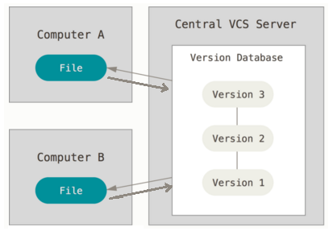
		
	- **分布式**: git

		- 每个用户本地电脑上都有完整的版本库，可以离线工作，速度快
		- 安全性高，每用户电脑里都有完整的版本库，坏了复制一份即可
		- 倾向于开源项目管理，对于保密项目，如果有一个人clone了代码，则项目所有的历史版本就都泄漏了
		
		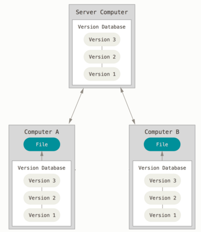

# Git版本库（本地仓库）

## Git版本库认识

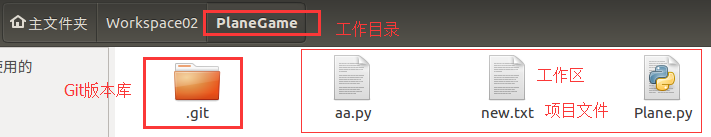

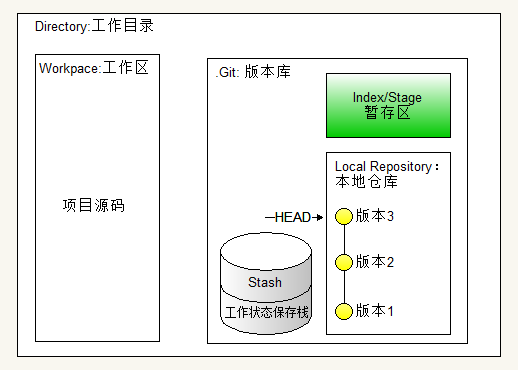

- **Directory**：由Git管理的一个目录，即项目的根目录。包含我们的工作区和Git仓库信息。
- **Workspace**： **工作区**，即项目的根目录，但不包括.git目录。
- **.git**： **Git版本库目录**，保存了所有的版本信息。该目录会由git初始化仓库的时自动生成。
- **Index/Stage(阶段；舞台)**： **暂存区**，我们修改了代码，会先提交到暂存区，然后再从暂存区提交到本地仓库。
- **Local Repo**： **本地仓库**，保存了项目所有历史变更版本
	- **HEAD指针：** **表示工作区当前版本，HEAD指向哪个版本，当前工作区就是哪个版本；**通过HEAD指针，可以实现版本回退。
- **Stash(存放；贮藏)**： **工作状态保存栈**，用于保存和恢复工作区的临时工作状态（代码状态）。

## Git安装和配置

1. 安装git

		sudo apt-get install git

- 设置git用户名和邮箱

	 	git config --global user.name "Your Name"
		git config --global user.email "youremail@example.com"

	git服务器会通过此用户名和邮箱来标识是谁提交的代码, 例如github: 
	
	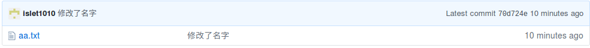

## 创建版本库&提交代码&查看历史版本

**一、创建版本库**

1. 创建飞机大战项目：PlaneGame, 并进入到该项目下。

- 编写飞机大战项目的源码： 比如添加一个文件Plane.py
	
- 为项目创建Git版本库
	 
		git init

	执行完该命令之后，在当前目录下会生成一个.git目录，在该目录下会保存项目所有历史变更版本。

**二、提交代码**

提交代码（到本地仓库）之后，会在版本库生成一个版本，分两步操作：

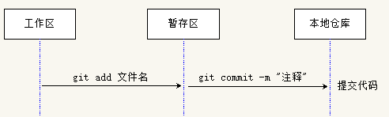

1. 提交代码（**代码修改**）到 **暂存区**

		# 一个文件作了修改，可以指定文件名
		git add 文件名 
		
		# 多个文件作了修改，可以指定当前目录。意思： 把当前目录下所有的代码修改都提交到暂存区
		git add .

- 提交 **暂存区** 的代码到 **本地仓库**

		git commit -m "代码修改说明"

- **注意事项：**

	如果使用`commit`命令，忘记了添加参数 `-m` 选项，则git会默认使用GNU Nano的编缉器打开 `.git/COMMIT_EDITMSG ` 文件。如下：

	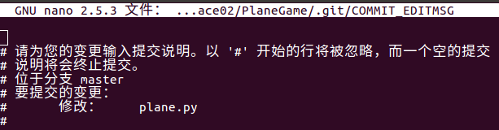

	有两种处理方式：
		
	- 第1种： 可以按 **ctrl+x** 退出即可， 然后再重新执行 `git commit `并指定 -m 选项提交代码
	- 第2种： 在打开的Nano编缉器中输入提交的注释说明， 再按 `ctrl + o` 保存， 接着按回车确认文件名， 最后再按`ctrl + x`退出， 回去之后，git就会提交之前的代码了。

**三、查看历史版本**

1. 通过以下命令查看提交了哪些历史版本：

		git log
	
	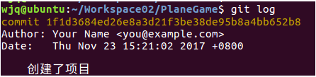

2. 用带参数的git log，输出的信息会短一些：
	
		git log --graph --pretty=oneline
	
	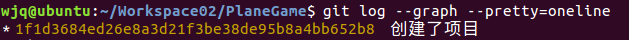
		
## 管理修改--查看和提交工作区修改

1. **查看工作区修改：**把工作区的代码提交到本地仓库之前，想查看工作区作了哪些修改（包括代码的新增，修改，删除），可以通过以下命令： 

		git status
	
	没有修改时提示：

	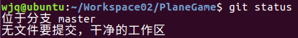

	有修改时提示：

	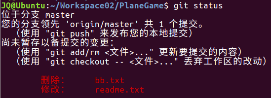

- **了解修改后提交代码：** 要管理这些修改，把这些代码都提交到本地仓库，分两步：

	1. 提交到暂存区

			git add .	

		提交代码暂存区后，再通过`git status`查看状态，字体变色了，如下：		 
		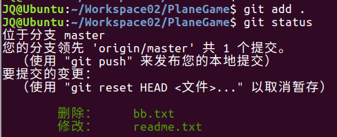

	- 提交到本地仓库

			git commit -m "注释" 	 

## 管理修改--对比文件

- 对比工作区和暂存区的某个文件，了解作了哪些修改： 

		git diff 文件名

	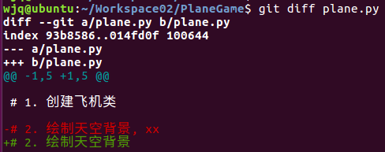

	说明：

	- 减号表示： 本地仓库的代码
	- 加号表示： 工作区的代码

## 撤销修改--版本回退

**一、版本回退**

1. **查看历史提交版本**（以便确定要回退到哪个版本）： 

		git log

	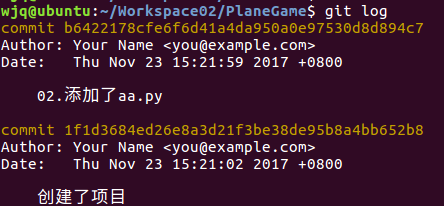

- **工作区回退到某个版本:**

		git reset --hard <commit版本号>

	选项说明：

	- --hard  重置： 本地仓库HEAD指针、暂存区、工作区
	- --mixed 重置： 本地仓库HEAD指针、暂存区         【默认值】
	- --soft  重置： 本地仓库HEAD指针

	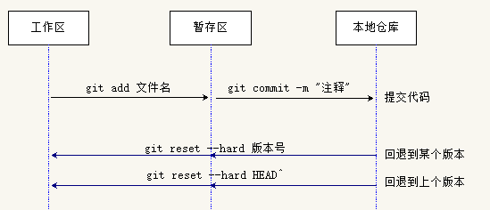

- **查看所有的历史版本：**（以便确定要回到未来的某个版本）	
	
		git reflog

	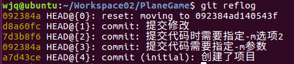

	注意：使用`git log`只能看到当前版本之前的版本

- 使用同样的命令，**回到未来的某个版本：**

		git reset --hard <commit版本号>

**二、通过 HEAD指针 实现版本回退**

HEAD指向的版本就是当前版本（即工作区版本），Git允许我们在通过HEAD指针回退到某个历史版本

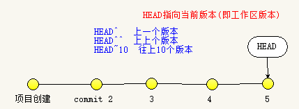

	# 回退到上个版本
	git reset --hard HEAD^

	# 回退到上上个版本
	git reset --hard HEAD^^

	# 往上10个版本
	git reset --hard HEAD~10

## 撤销修改--撤销工作区和暂存区修改

有时候改错了，想**撤销工作区和暂存区的修改**，要怎么做呢？
	
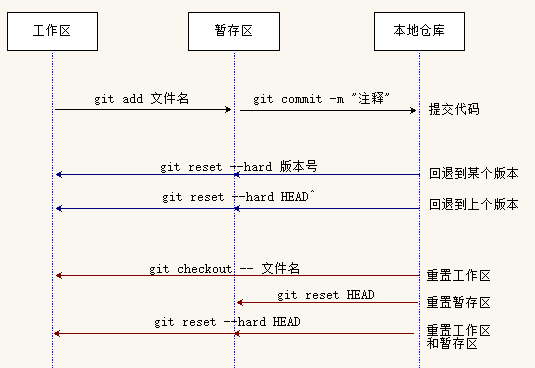

- **场景1：** 改乱了工作区的代码，想撤销工作区的代码修改

		git checkout -- <file>  # 撤销指定文件的修改
		git checkout -- .		# 撤销当前目录下所有修改

	小提示:	通过`git status `能看到上述的命令提示

	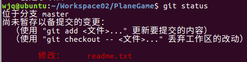

	说明：
	- `git checkout` 会用本地仓库中的版本替换工作区的版本，无论工作区是修改还是删除，都可以“一键还原”。    

- **场景2：** 改乱了工作区某个文件，并且还提交到了暂存区，同时撤销工作区和暂存区修改：

	方法一： 

	- 第1步： 撤销暂存区修改
	
			git reset HEAD <file>     # 撤销暂存区指定文件的修改		
			git reset HEAD            # 撤销暂存区所有修改

		小提示:	通过`git status `能看到上述的命令提示

		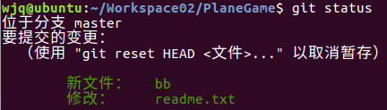

	- 第2步： 撤销工作区修改， 请参见场景1

	方法二：

	直接使用以下命令，一次性同时撤销暂存区和工作区的修改： 

		git reset --hard HEAD

## 删除文件
	
如果在本地，通过文件管理器，或者通过rm命令，把一个文件删掉了，有两种场景：

- **场景1：** 如果该文件是属于误删，那么要恢复回来：

		git checkout -- 文件名

- **场景2：** 确实要删除该文件： 

	1. 提交代码修改到暂存区：
			
			git add <文件名>	    # 把文件修改操作，提交到暂存区

	- 工作区删除后，提交代码修改到本地仓库
		
			git commit -m "注释"

# 分支管理

## 分支的概念及使用

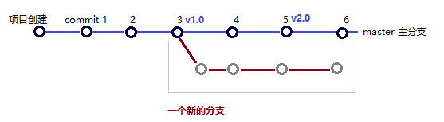

- 分支就是一条独立的版本线，在此分支开发一个单独的功能，提交和下载代码，不会对其它分支造成任何影响。
- Git创建分支极快，瞬间完成，无论你的版本库是1个文件还是1万个文件。
- Git鼓励大量使用分支，开发一个新的功能，最好新创建一个分支，在新分支实现完功能之后，再合并分支。解决bug也可以创建一个新的分支，解决完bug之后，再把分支删除掉。

- 分支使用

	在实际开发中，我们会创建多个分支，按照几个基本原则进行分支管理：

	- master 主分支： 该分支是非常稳定的，仅用来发布新版本，不会提交开发代码到这里
	- dev 开发分支： 不稳定的，团队成员都把各自代码提交到这里。当需要发布一个新版本，经测试通过后，把dev分支合并到master分支上, 作为一个稳定版本，比如v1.0
	- featrue 功能分支： 团队每个人负责不同的功能，分别有各的分支，在各自的分支中干活，适当的时候往 dev开发分支合并代码。
	
	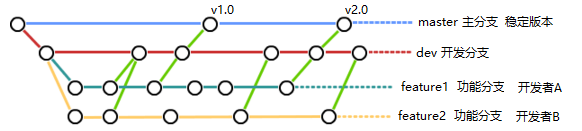 

## 分支创建查看切换及合并

**一、分支工作原理**

1. 在Git版本库中，默认有一条版本线，这个分支叫主分支，即master分支。严格来说，HEAD不是指向提交，而是指向master，master才是指向提交的。

	一开始的时候，master分支是一条线，Git用master指向最新的提交，再用HEAD指向master，就能确定当前分支，以及当前分支的提交点：
	
	

	每次提交，master分支都会向前移动一步，这样，随着你不断提交，master分支的线也越来越长。
	
	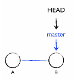

2. 当我们创建新的分支，例如dev时，Git新建了一个指针叫dev，指向master相同的提交，再把HEAD指向dev，就表示当前分支在dev上：

	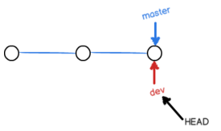

3. 从现在开始，对工作区的修改和提交就是针对dev分支了，比如新提交一次后，dev指针往前移动一步，而master指针不变: 

	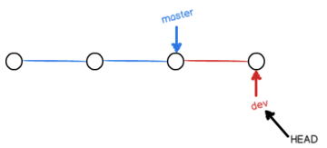

4. 假如我们在dev上的工作完成了，就可以把dev合并到master上。Git怎么合并呢？最简单的方法，就是直接把master指向dev的当前提交，就完成了合并。
		
	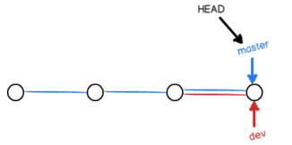

小结： 

- 每个分支都有一个指针，指向当前分支的最新版本
- 每次提交一个版本，分支指针就会向前移动一步，HEAD指针也会往前移动一步； 
- **HEAD指针： 表示工作区当前版本，HEAD指向哪个版本，当前工作区就是哪个版本；**

**二、操作演示**

1. 创建分支

		git branch dev	   # 创建分支 (开发分支)

- 切换分支

		git checkout dev   # 切换分支

	以上两个操作，可以使用以下一个命令代替

		git checkout -b dev   # 创建+切换分支

- 查看当前所处的分支：

	`git branch` 命令会列出所有分支，当前分支前面会标一个*号
	 
		git branch

	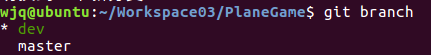

- 在新分支上修改代码，提交，然后再 **通过`git checkout master`切换回主分支**，在主分支查看代码，发现不会对主分支有任何的影响

- 再把dev分支的代码合并到master分支上（**合并到哪个分支就需要先切换回哪个分支**），合并后，打开修改的文件，就能看到新内容了

		git merge dev

## 分支合并冲突演示

上面演示了分支的创建和合并，我们在dev分支作了修改，而master分支并没修改，所以没遇到问题，非常简单地就完成了。而实际开发中，常用master分支也是会有修改了，两个分支各自都有修改，合并时，就不会这么一帆风顺了，合并时会遇到 **代码冲突** 的问题： 

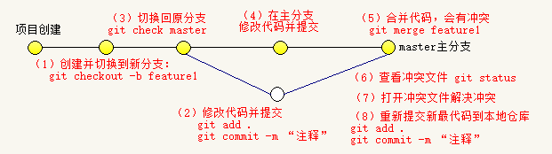

1. **创建** 并 **切换** 到feature1新分支，继续我们的新分支开发：

		git checkout -b feature1

- 随便修改一下Plane.py，并提交代码：

		git add .
		git commit -m "创建feature1新分支，并添加新功能"

- 切换回master分支：

		git checkout master

- 随便修改一下Plane.py，并提交代码：。

		git add .
		git commit -m "master分支修改"

	现在，master分支和feature1分支各自都分别有新的提交，变成了这样
	
	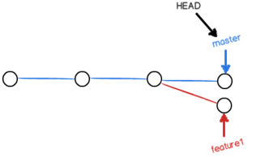

- 合并出现冲突：
	
	执行合并命令

		git merge feature1 

	**出现冲突**，Git告诉我们，Plane.py文件存在冲突，必须手动解决冲突后再提交:

	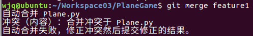

## 查看并解决冲突

1. 查看并解决冲突

		git status

	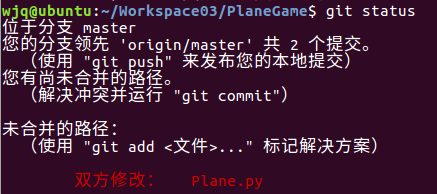

	通过 `vi Plane.py` 查看Plane.py内容如下：
	
	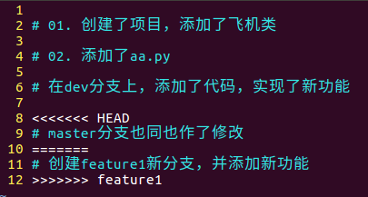

	Git用<<<<<<<，=======，>>>>>>>标记出不同分支的内容，我们修改合并内容如下，然后保存。
	
	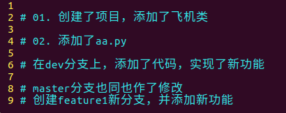

- 再提交解决冲突后的代码

		git add .
		git commit -m "冲突解决"

	最后变成这样子： 

	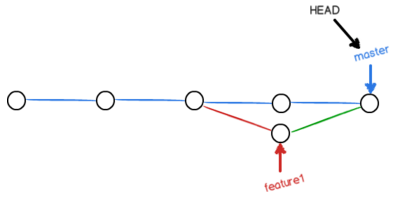

- 查看分支情况
	
	用带参数的git log也可以看到分支的合并情况：
	
		git log --graph --pretty=oneline

	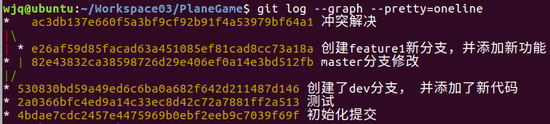

## 分支合并演示2

通过前面的例子，关于分支合，我们已经演示了下面的1，2两种场景，对于场景3后结果会怎么样呢？

|  | master分支 | feature1分支 | feature1合并到master的结果 |
|--------|--|--|--|
| 场景1 |无修改|`readme文件` 有修改|自动合并成功|
| 场景2 |`readme文件` 有修改|`readme文件` 有修改|合并后有冲突，需要解决冲突，再提交代码|
| 场景3 |无修改|有新增文件| ?? |

实验结果： 

- 合并后，会自动弹出一个窗口, 要求输入提交的注释，输入完注释后，按`ctrl+x`返回退出： 

	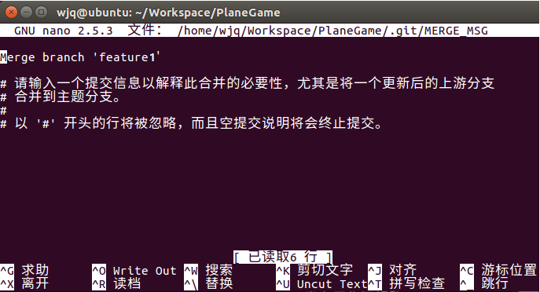

- **新分支的新文件，在master分支中不存在，所以合并到master分支后，要把该新文件提交到主分支上，就需要指定commit命令的提交注释。**

## 分支删除

- 删除一个已合并的分支，**注意，无法删除当前所在的分支，需要切换到其它分支，才能删除**

		git branch -d 分支名

- 如果分支还没有被合并，删除分支将会丢失修改。如果要强行删除，需要使用如下命令：

		git branch -D 分支名

- 删除之后通过以下命令，就查看不到了

		git branch

## BUG分支(保存工作现场)

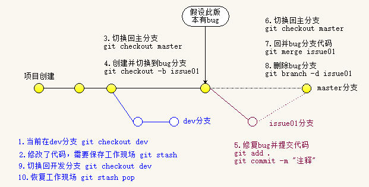	

- **bug分支：**当你接到修复一个bug任务的时候，可以创建一个bug临时分支（例如：issue01）来修复它，修改完成再把该分支删除掉
- **问题：**当前正在dev上进行的工作还没有提交, 工作只进行到一半，还没法提交，但如果不提交就切换到其它分支工作，代码会丢失，怎么办呢？
- **使用工作状态保存栈：**Git版本库中有一个 **Stash 临时状态保存栈**, 可以使用它来保存当前工作现场，把当前工作现场保存起来，等完成了其它紧急工作，再回来恢复工作现场，继续接着工作

- **工作状态保存栈使用：**

	1. 保存当前工作现场
	
			git stash  

	- 查看有哪些临时现场
	
			git stash list
		
		输出结果：
		
		stash@{0}: WIP on dev: 6224937 add merge

	- 恢复某个临时现场

			git stash apply stash@{0} 

	- 恢复最近保存的工作现场
			
			git stash pop

	- 清空工作状态保存栈

			git stash clear

- 案例演示

	假设当前在dev分支上工作, master分支有bug，需要紧急修复
	
		git checkout dev		    # 当前在dev分支上工作
		git stash					# 工作到一半，需要保存工作现场

		# 要修复到哪个分支的bug(假定是master分支)，就切换到哪个分支，并创建临时bug分支
		git checkout master			# 切换到master分支 
		git checkout -b issue01		# 创建并切换到bug临时分支

		git add readme.txt 			
		git commit -m "fix bug"	 	 # bug修改完，提交修改

		git checkout master			 # 改完bug切换回master主分支
		git merge issue01			 # 合并bug分支到主分支

		git branch -d issue01		 # 删除bug分支

		git checkout dev			 # 切换回开发分支

		git stash pop                # 恢复到之前的工作现场

# 使用Github（远程仓库）

## Git托管平台

- GitHub

	- 官网地址： [http://www.github.com](http://www.github.com)
	- 世界最知名的开源项目免费托管平台，有海量的开源代码
	- 只支持git版本控制，故名gitHub
	- GitHub上免费托管的项目，任何人都可以看到，但只有自己能改
	- 如果想让上传的项目别人看不到，可以交点保护费，把github上的项目变成私有
	- 速度慢

- 码云

	- 官网地址： [http://www.gitee.com](http://www.gitee.com)
	- 是开源中国社区团队推出的基于Git的在线代码托管平台
	- 可免费托管私有库，不限制私有和公有库数量
	- 速度快

## 配置SSH密钥对

- Git通信协议

	- Git支持多种协议，包括SSH, https协议
	- 使用ssh协议速度快，但是在某些只开放http端口的公司，内部就无法使用ssh协议， 而只能用https了
	- 与ssh相比，使用https速度较慢，而且每次通过终端上传代码到远程仓库时，都必须输入账号密码

- 配置SSH密钥对
	
	Git服务器会使用SSH密钥对来确认代码提交者的合法身份。
	
	1. 登录github网站，注册github账号
	
	2. 创建SSH密钥对
	
		查看ubuntu **用户根目录**下(即： **/home/用户名** 目录)， 是否有`.ssh`目录 （可以通过在文件管理器中按 `ctrl + h` 显示隐藏文件快速查看）
	
		- 有`.ssh`目录，并且该目录下有id_rsa 和 id_rsa.pub这两个文件，则跳到第2步
		- 没有，打开Shell执行以下命令创建
				
				$ ssh-keygen -t rsa -C youremail@example.com
			
			按三次回车，即可生成.ssh目录，里面存放的就是ssh的密钥对：id_rsa （私钥）和id_rsa.pub （公钥）
	
	3. 查看生成的：id_rsa.pub公钥
	
			cat ~/.ssh/id_rsa.pub
	
		会输出类似以下的字符串，即： **公钥字符串**：
			
			ssh-rsa AAAAB3NzaC1yc2EAA(省略...)AvoIWr9MB5Dihmv62J islet1010@163.com
	
	4. 把上述的**公钥字符串**配置到 GitHub 的后台	
	
		登陆GitHub，点击 头像 -> settings -> SSH And GPG keys -> New SSH Keys: 
	
		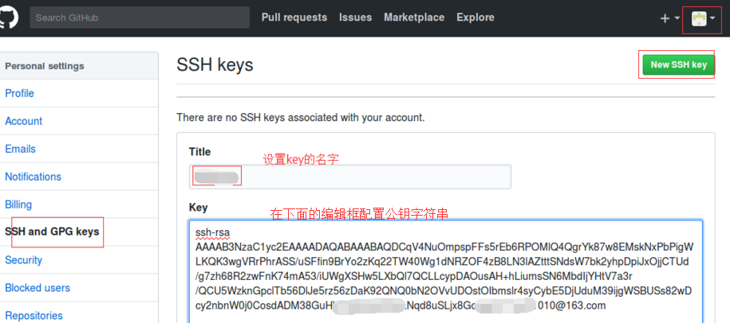
	
		> GitHub会通过上面的id_rsa.pub，能够识别是你进行了代码提交，而不是别人冒充的。
	
	5. 验证是否配置成功
	 
		在终端执行以下命令:
	
			ssh -T git@github.com
		
		第一次，**需要输入“yes”**, 若返回类似 “Hi islet1010! You've successfully authenticated”，则配置成功。如下图：
		
		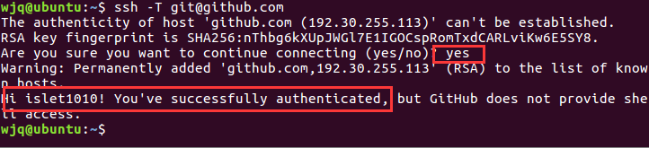

## 上传本地项目

上传用户本地的项目到服务器：

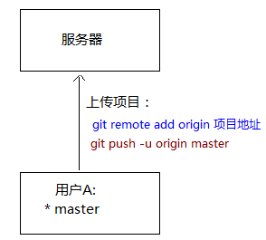

1. 创建远程仓库: 登陆GitHub创建一个新的远程仓库： 
	
	在右上角找到“Create a new repo”按钮，Repository name填入项目名，再点击创建按钮：

	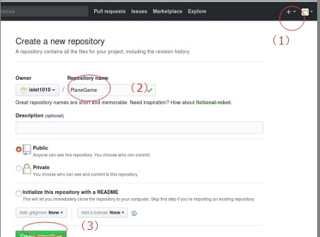

	仓库创建出来后，目前为空，要把本地的项目上传上来。

2. 获取刚创建的Github远程仓库的地址	

	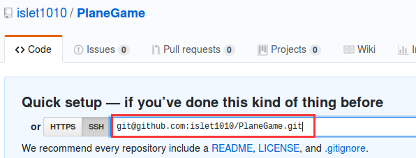

		git@github.com:islet1010/PlaneGame.git

3. 添加Git远程仓库地址
		
		git remote add origin git@服务名:路径/仓库名.git

		# 示例： 
		git remote add origin git@github.com:islet1010/PlaneGame.git
	
		
	如果提示：`fatal: 远程 origin 已经存在`， 则只需使用以下命令将远程配置删除，重新添加即可： 

		git remote rm origin

4. 推送代码到服务器

		# -u 参数把本地的master分支和远程的master分支关联起来
		git push -u origin master

	看到类似如下的返回，则表示代码上传到远程仓库成功！

	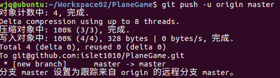

## 克隆项目

clone 克隆: 下载服务器上的项目到本地

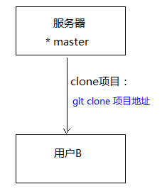

1. 获取要clone项目的地址，假设是上面刚上传的项目，它的地址：

		git@github.com:islet1010/PlaneGame.git

2. 进入ubuntu的某一个目录，例如 `Workpace03 `目录，目前该目录为空：

3. 执行clone命令

		git clone git@github.com:islet1010/PlaneGame.git

	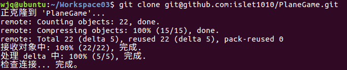

	如上图，下载项目成功

## 推送分支 
 
把本地仓库 该分支所有的修改，推送到远程仓库对应的分支上,以便团队中其中人看到：

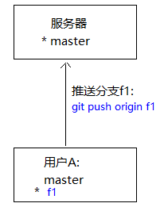

**注意：并不需要把本地所有分支，都推送到服务器**

- master分支是主分支，因此要时刻与远程同步；
- dev分支是开发分支，团队所有成员都需要在上面工作，所以也需要与远程同步；
- bug分支只用于在本地修复bug，就没必要推到远程了，修复完bug一般会删除掉；
- feature分支是否推到远程，取决于你是否和你的小伙伴合作开发。

演示： 

1. 创建并切换到分支f1

		git checkout -b f1

2. 修改代码并提交
		
		git add .
		git commit -m "注释"

3.  推送分支到服务器

		git push origin f1

	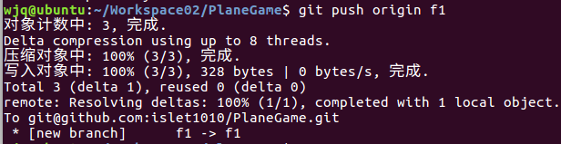

4. 到github上查看，会看到有新增了分支

	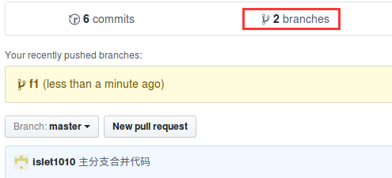

		
## 拉取分支

团队开发时，更新服务器上别人提交的代码到本地：

1. **场景一： 要拉取的分支本地不存在:**

	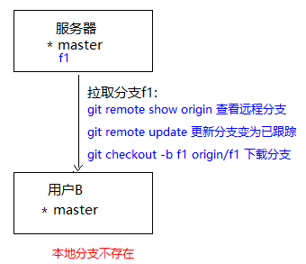

	1. 查看远程分支情况：

			git remote show origin

		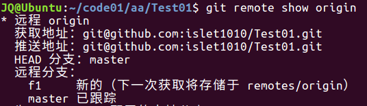

	- 对于 **已跟踪的远程分支**，可以通过以下命令直接拉取下来（**本地和远程分支的名称最好一致**）：

			git checkout -b 本地分支名 origin/远程分支名

	- **对于 新的远程分支，需要先获取更新，让新分支变为已跟踪状态，然后才能拉取。**否则直接拉取会出错，比如拉取f1，出错如下：
	
		
		
		正确步骤：

		1. 通过以下命令**获取更新新分支**，让新分支变为已跟踪状态
			
				git remote update
			
			

			再查看，新分支f1就变为已跟踪状态了：
				
			

		- 再通过以下命令拉取新分支：

				git checkout -b f1 origin/f1

			该命令会在本地创建出f1分支，并自动把服务器的f1分支的内容拉取下来。

			

- **场景二： 要拉取的分支本地已存在：**
 
	1. **情况1：**本地分支与远程分支 **已建立关联：** 

			git pull   # 拉取服务器分支的最新代码，与当前本地分支合并

		1. 如果远程分支没有更新，则提示：

			

		- 如果有更新，会提示更新内容：

			

		- 如果有冲突，按前面介绍的分支合并冲突方式解决。

			

	- **情况2：**本地分支与远程分支 **未建立关联：**
 
 		1. **跟踪远程分支：**建立本地与远程分支的链接关系: 

				git branch --set-upstream-to=origin/远程分支名 本地分支名

			**提示：**若本地分支与远程分支未建立关联，使用`git pull`下载该远程分支，会有`no tracking information`出错提示

		- 然后再拉取分支最新代码： 

				git pull

		

# 扩展资料

[https://git-scm.com/book/zh/v2](https://git-scm.com/book/zh/v2)

## 忽略特殊文件

- 某些文件需要放到Git工作目录中，但又不能提交它们，比如保存了数据库密码的配置文件等。
- 每次git status都会显示 “Untracked files ...”
- 在Git工作区的根目录下创建一个特殊的`.gitignore`文件，然后把要忽略的文件名填进去，Git就会自动忽略这些文件
- 以下文件应该忽略：

	- 操作系统自动生成的文件，比如缩略图Thumbs.db等
	- 忽略编译生成的中间文件、可执行文件等，比如Java编译产生的.class文件
	- 有敏感信息的配置文件，比如存放口令的配置文件

- 不需要从头写.gitignore文件，GitHub已经为我们准备了各种配置文件，只需要组合一下就可以使用了。所有配置文件可以直接在线浏览：[https://github.com/github/gitignore](https://github.com/github/gitignore)：
	
- 示例： `.gitignore`文件

		# Windows:
		Thumbs.db
		ehthumbs.db
		Desktop.ini
		
		# Python:
		*.py[cod]
		*.so
		*.egg
		*.egg-info
		dist
		build
		
		# My configurations:
		db.ini